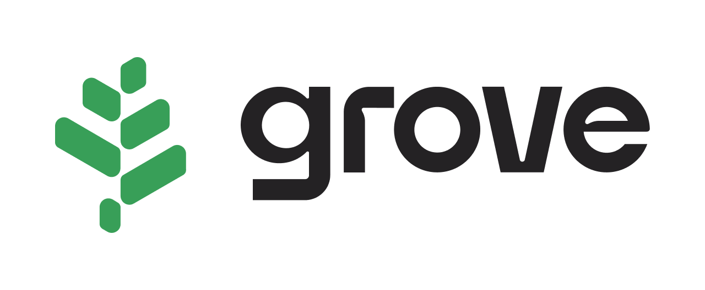

<h1>Backend pre-commit Hooks</h1>
<big>A collection of useful Golang pre-commit hooks for our backend repos.</big>

 

🙌 Based off of the now-sunsetted repo from [@dnephin](https://github.com/dnephin). [Repo here](https://github.com/dnephin/pre-commit-golang) 🙌

## Installation

Run `make init-pre-commit` from the backend repo root.

## Using these hooks

Add this to your `.pre-commit-config.yaml`

    - repo: https://github.com/pokt-foundation/backend-precommit-hooks
        rev: v0.0.2 [UPDATE THE VERSION AS NEEDED]
        hooks:
        - id: go-fmt
        - id: go-imports
        - id: golangci-lint
        - id: go-critic
        - id: go-build
        - id: go-mod-tidy
        - id: go-unit-tests

## Available hooks

- `go-fmt` - Runs `gofmt`, requires golang
- `go-vet` - Runs `go vet`, requires golang
- `go-imports` - Runs `goimports`, requires golang.org/x/tools/cmd/goimports
- `golangci-lint` - run `golangci-lint run ./...`, requires
  [golangci-lint](https://github.com/golangci/golangci-lint)
- `go-critic` - run `gocritic check ./...`, requires [go-critic](https://github.com/go-critic/go-critic)
- `go-unit-tests` - run `CGO_ENABLED=0 go test ./...`
- `go-all-tests` - run `make test`
- `go-build` - run `go build`, requires golang
- `go-mod-tidy` - run `go mod tidy -v`, requires golang
